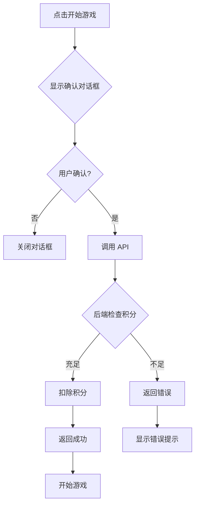

# 五子棋 AI 游戏

> **项目地址**：[EbbinghausAnywhere - GitHub](https://github.com/myGitToy/EbbinghausAnywhere)
> **PR编号**：PR #13
> **创建日期**：2026-02-11
> **功能分支**：feat_游戏_五子棋
> **目标分支**：main
> **合并日期**：2026-02-11
> **合并提交**：b5caa2c

## 功能概述

为 EbbinghausAnywhere 记忆系统添加五子棋 AI 游戏，通过积分消费机制提供休闲娱乐功能，同时增强用户粘性和积分系统的实用价值。

## 背景说明

在学习应用中引入游戏功能可以：

- **劳逸结合**：提供学习间隙的放松方式
- **积分消耗场景**：为积分系统提供实际消费场景
- **用户留存**：通过娱乐功能提升用户活跃度
- **AI 展示**：展示项目的技术能力

本 PR 实现了完整的五子棋游戏功能，包括 React 前端、Django 后端集成和积分消费机制。

## 技术实现

### 1. 架构设计

采用前后端分离架构：

```
┌─────────────────────────────────────────────────────────────┐
│                        Django 模板层                          │
│                    gobang.html (iframe 嵌入)                  │
└────────────────────┬────────────────────────────────────────┘
                     │
                     ▼
┌─────────────────────────────────────────────────────────────┐
│                       React 应用                              │
│  static/gobang/ (create-react-app 构建的静态文件)             │
│  ┌──────────────────────────────────────────────────────┐   │
│  │  游戏逻辑  │                                          │   │
│  │  - 棋盘状态管理                                        │   │
│  │  - Alpha-Beta 剪枝算法                                  │   │
│  │  - 胜负判定                                            │   │
│  └──────────────────────────────────────────────────────┘   │
│  ┌──────────────────────────────────────────────────────┐   │
│  │  UI 组件     │                                          │   │
│  │  - 棋盘渲染                                            │   │
│  │  - 控制面板                                            │   │
│  │  - 难度设置                                            │   │
│  └──────────────────────────────────────────────────────┘   │
└────────────────────┬────────────────────────────────────────┘
                     │
                     ▼
┌─────────────────────────────────────────────────────────────┐
│                      Django API                              │
│              /api/gobang/start/ (积分扣除)                     │
└─────────────────────────────────────────────────────────────┘
```

### 2. React 前端实现

#### 项目结构

```
external/gobang/
├── src/
│   ├── components/
│   │   ├── board.js          # 棋盘组件
│   │   ├── control.js        # 控制面板组件
│   │   └── cell.js           # 棋盘格子组件
│   ├── utils/
│   │   └── ai.js             # AI 算法实现
│   └── App.js                # 主应用组件
├── package.json              # 依赖配置
└── README.md
```

#### AI 算法：Alpha-Beta 剪枝

```javascript
function alphaBeta(position, depth, alpha, beta, maximizingPlayer) {
    if (depth === 0 || position.isGameOver()) {
        return evaluate(position);
    }

    if (maximizingPlayer) {
        let maxEval = -Infinity;
        for (let child of position.getChildren()) {
            let eval = alphaBeta(child, depth - 1, alpha, beta, false);
            maxEval = Math.max(maxEval, eval);
            alpha = Math.max(alpha, eval);
            if (beta <= alpha) break; // Beta 剪枝
        }
        return maxEval;
    } else {
        let minEval = Infinity;
        for (let child of position.getChildren()) {
            let eval = alphaBeta(child, depth - 1, alpha, beta, true);
            minEval = Math.min(minEval, eval);
            beta = Math.min(beta, eval);
            if (beta <= alpha) break; // Alpha 剪枝
        }
        return minEval;
    }
}
```

**难度级别配置**：

| 难度 | 搜索深度 | 思考时间 | 特点 |
|------|---------|---------|------|
| 简单 | 2层 | <100ms | 适合新手 |
| 中等 | 3层 | 100-500ms | 有一定挑战 |
| 困难 | 4层 | 500ms-2s | 接近业余水平 |

#### 状态管理

使用 React Context + hooks 管理游戏状态：

```javascript
const GameContext = createContext({
    board: [],           // 棋盘状态 15x15
    currentPlayer: 1,    // 当前玩家 (1: 黑棋, 2: 白棋)
    gameState: 'idle',   // idle/gaming/ended
    difficulty: 3,       // AI 难度
    winner: null,        // 获胜者
});
```

### 3. Django 后端集成

#### 视图函数

**gobang_game**: 游戏主页视图

```python
@login_required
def gobang_game(request):
    # 获取用户积分账户
    points_account = get_object_or_404(UserPoints, user=request.user)

    context = {
        'remaining_points': points_account.current_points,
        'total_spent': points_account.total_spent,
        'points_per_game': 5,
        'debug_info': f'DB total_spent={points_account.total_spent}'
    }
    return render(request, 'gobang.html', context)
```

**gobang_start_game_api**: 开始游戏 API

```python
@require_POST
@login_required
def gobang_start_game_api(request):
    REQUIRED_POINTS = 5

    try:
        with transaction.atomic():
            # 获取积分账户（带锁）
            points_account = UserPoints.objects.select_for_update().get(
                user=request.user
            )

            # 检查积分
            if points_account.current_points < REQUIRED_POINTS:
                return JsonResponse({
                    'success': False,
                    'message': f'积分不足！开始游戏需要{REQUIRED_POINTS}积分，'
                              f'当前{points_account.current_points}积分'
                })

            # 扣除积分
            points_account.current_points -= REQUIRED_POINTS
            points_account.total_spent += REQUIRED_POINTS
            points_account.save()

            # 创建历史记录
            PointHistory.objects.create(
                user=request.user,
                points_change=-REQUIRED_POINTS,
                reason='游戏消费',
                reference_id=f'gobang_{uuid.uuid4().hex[:8]}'
            )

            return JsonResponse({
                'success': True,
                'message': f'开始游戏成功！扣除{REQUIRED_POINTS}积分',
                'remaining_points': points_account.current_points,
                'total_spent': points_account.total_spent,
                'points_per_game': REQUIRED_POINTS
            })

    except Exception as e:
        return JsonResponse({
            'success': False,
            'message': f'服务器错误：{str(e)}'
        })
```

#### 路由配置

```python
# EAW/urls.py
urlpatterns = [
    path('gobang/', views.gobang_game, name='gobang'),
    path('api/gobang/start/', views.gobang_start_game_api, name='gobang_start_api'),
]
```

#### 导航栏集成

在导航栏添加五子棋入口：

```html
<!-- EAW/templates/includes/navbar.html -->
<li class="nav-item">
    <a class="nav-link" href="">
        <i class="fa fa-gamepad"></i> 五子棋
    </a>
</li>
```

### 4. 积分消费机制

#### 消费规则

| 场景 | 积分消耗 | 限制 |
|------|---------|------|
| 开始一局游戏 | 5 积分 | 每次点击"开始游戏" |
| 悔棋 | 0 | 无限制 |
| 认输 | 0 | 无限制 |
| 调整难度 | 0 | 随时调整 |

#### 积分检查流程



#### 积分不足处理

创建专门的积分不足提示页面：

```python
def gobang_insufficient_points(request):
    points_account = get_object_or_404(UserPoints, user=request.user)
    return render(request, 'gobang_insufficient_points.html', {
        'current_points': points_account.current_points,
        'required_points': 5
    })
```

### 5. 静态文件部署

#### 构建配置

**package.json** 配置：

```json
{
  "name": "gobang-v3",
  "version": "0.1.0",
  "homepage": ".",
  "private": true,
  "dependencies": {
    "react": "^18.2.0",
    "react-dom": "^18.2.0",
    "react-scripts": "5.0.1"
  }
}
```

**关键配置**：
- `homepage: "."` - 使用相对路径，确保在 iframe 中正确加载资源

#### 部署流程

```bash
# 1. 开发 React 应用
cd external/gobang
npm start

# 2. 构建生产版本
npm run build

# 3. 复制到 Django 静态目录
cp -r build/* ../../static/gobang/

# 4. 验证路径
grep 'static/' static/gobang/index.html
# 应该看到 ./static/js/ 而非 /static/js/
```

#### 静态文件清单

```
static/gobang/
├── index.html              # 入口 HTML（使用相对路径）
├── favicon.ico            # 网站图标
├── manifest.json          # PWA 配置
├── asset-manifest.json    # 资源清单
└── static/
    ├── css/
    │   └── main.24ac5095.css
    ├── js/
    │   ├── main.4e22008a.js
    │   ├── 453.afcdadab.chunk.js
    │   └── *.js.map
    └── media/
        └── bg.5f5d204f7a75ee4fe91c.jpg  # 背景图片
```

### 6. 跨窗口通信

使用 `window.postMessage` 实现 iframe 与父页面的积分同步：

```javascript
// React 组件中发送积分更新
window.parent.postMessage({
    type: 'POINTS_UPDATED',
    total_spent: newTotalSpent,
    remainingPoints: newRemainingPoints
}, '*');

// Django 模板中接收消息
window.addEventListener('message', function(event) {
    if (event.data.type === 'POINTS_UPDATED') {
        // 更新页面显示
        document.querySelector('.card-body strong').textContent =
            event.data.remainingPoints;
    }
});
```

## 使用说明

### 开始游戏

1. **访问五子棋页面**：点击导航栏"五子棋"链接
2. **查看积分信息**：页面显示当前积分和累计消费
3. **点击开始游戏**：弹出积分确认对话框
4. **确认开始**：扣除 5 积分，游戏开始

### 游戏操作

| 操作 | 说明 |
|------|------|
| 落子 | 点击棋盘空白位置 |
| 悔棋 | 点击"悔棋"按钮，撤销一步 |
| 认输 | 点击"认输"按钮，结束游戏 |
| 调整难度 | 在游戏开始前调整 AI 难度 |

### 难度选择

- **简单**：AI 搜索深度 2 层，适合新手
- **中等**：AI 搜索深度 3 层，有一定挑战
- **困难**：AI 搜索深度 4 层，接近业余水平

### 积分规则

- 每局游戏消耗 5 积分
- 悔棋和认输不额外扣分
- 重新开始需要再次点击"开始游戏"

## 边界情况处理

| 场景 | 处理策略 |
|------|----------|
| 积分不足 | 显示"积分不足"提示，禁用开始按钮 |
| 网络错误 | 显示"无法连接到服务器"错误 |
| 并发开始 | 使用数据库事务锁，确保积分正确扣除 |
| 游戏进行中 | 禁用难度调整和开始按钮 |
| 刷新页面 | 不自动扣分，需重新点击开始 |
| iframe 加载失败 | 显示错误提示，提供刷新按钮 |

## 测试验证

### 静态文件测试

**测试文件**：[test_gobang_static_files.py](../../EAW/tests/test_gobang_static_files.py)

| 测试类别 | 测试数量 | 通过率 |
|---------|---------|--------|
| 目录结构验证 | 5 | 100% |
| 配置文件验证 | 1 | 100% |
| 路径配置验证 | 1 | 100% |
| Django 集成测试 | 6 | 100% |
| **总计** | **13** | **100%** |

详见：[GOBANG_TEST_REPORT.md](../../EAW/tests/GOBANG_TEST_REPORT.md)

### 积分系统测试

**测试文件**：[test_gobang_points.py](../../EAW/tests/积分系统/test_gobang_points.py)

#### 后端 API 测试

| 测试用例 | 描述 | 状态 |
|---------|------|------|
| test_start_game_api_requires_login | 访问控制 | ✅ |
| test_start_game_deducts_5_points | 积分扣除 | ✅ |
| test_start_game_with_insufficient_points | 积分不足处理 | ✅ |
| test_start_game_creates_history_record | 历史记录 | ✅ |
| test_start_game_response_includes_remaining_points | 响应格式 | ✅ |
| test_multiple_games_deduct_multiple_times | 多局游戏 | ✅ |
| test_start_game_with_zero_points | 零积分处理 | ✅ |
| test_start_game_with_exactly_5_points | 边界测试 | ✅ |

#### 前端组件测试

| 测试用例 | 描述 | 状态 |
|---------|------|------|
| 组件正常渲染 | 基本渲染 | ✅ |
| 显示确认对话框 | 用户交互 | ✅ |
| API调用成功 | 积分扣除 | ✅ |
| 积分不足处理 | 错误处理 | ✅ |
| 网络错误处理 | 异常处理 | ✅ |
| 按钮状态管理 | 状态管理 | ✅ |

详见：[GOBANG_POINTS_TEST_REPORT.md](../../EAW/tests/积分系统/GOBANG_POINTS_TEST_REPORT.md)

### 手动验证步骤

1. **登录系统**：使用测试用户登录
2. **访问五子棋页面**：验证页面正常加载
3. **检查积分显示**：验证剩余积分和累计消费正确
4. **点击开始游戏**：
   - 验证确认对话框弹出
   - 验证积分扣除成功
   - 验证游戏正常开始
5. **测试 AI 对战**：
   - 落子响应正常
   - AI 思考时间合理
   - 胜负判定正确
6. **测试积分不足场景**：
   - 将积分设置为 0
   - 验证无法开始游戏
   - 验证错误提示显示

## 性能影响

- **数据库查询**：每次开始游戏增加 2 次查询（读取 + 更新积分账户）
- **静态文件大小**：React 应用约 500KB（gzipped 后约 150KB）
- **AI 思考时间**：
  - 简单：<100ms
  - 中等：100-500ms
  - 困难：500ms-2s
- **并发处理**：使用 `select_for_update()` 防止积分扣除竞态条件

## 已知问题

1. **AI 搜索深度限制**：由于浏览器性能限制，搜索深度最大为 4 层
2. **手机适配**：在手机屏幕上棋盘较小，用户体验有待优化
3. **历史记录**：当前不保存游戏对局记录

## 未来扩展

1. **对局记录**：保存游戏对局，支持复盘分析
2. **联机对战**：支持双人对战和匹配系统
3. **棋谱导入导出**：支持 SGF 格式棋谱
4. **更多 AI 算法**：引入 MCTS（蒙特卡洛树搜索）算法
5. **棋力评估**：根据玩家表现评估棋力等级
6. **成就系统**：
   - 连胜成就
   - 击败高难度 AI 成就
   - 特殊棋型成就
7. **排行榜**：
   - 胜率排行
   - 连胜排行
   - 总场次排行

## 相关文件

### 后端文件

- [EAW/views.py](../../EAW/views.py) - gobang_game 和 gobang_start_game_api 视图
- [EAW/urls.py](../../EAW/urls.py) - 路由配置
- [EAW/templates/gobang.html](../../EAW/templates/gobang.html) - 游戏主页模板
- [EAW/templates/gobang_insufficient_points.html](../../EAW/templates/gobang_insufficient_points.html) - 积分不足页面
- [EAW/templates/includes/navbar.html](../../EAW/templates/includes/navbar.html) - 导航栏集成

### 前端文件

- [external/gobang/](../../external/gobang/) - React 应用源码
- [static/gobang/](../../static/gobang/) - 构建后的静态文件

### 测试文件

- [EAW/tests/test_gobang_static_files.py](../../EAW/tests/test_gobang_static_files.py) - 静态文件测试
- [EAW/tests/积分系统/test_gobang_points.py](../../EAW/tests/积分系统/test_gobang_points.py) - 积分系统测试

### 文档文件

- [EAW/tests/GOBANG_TEST_REPORT.md](../../EAW/tests/GOBANG_TEST_REPORT.md) - 静态文件测试报告
- [EAW/tests/积分系统/GOBANG_POINTS_TEST_REPORT.md](../../EAW/tests/积分系统/GOBANG_POINTS_TEST_REPORT.md) - 积分系统测试报告
- [TESTS_README.md](../../TESTS_README.md) - 测试总览

## 提交记录

```
commit b5caa2c
Merge pull request #13 from myGitToy/feat_游戏_五子棋
Feat 游戏 五子棋

commit acdaeba
添加积分检查功能

commit 98098f5
更新积分通知系统

commit 4165d1c
修改控制台编码和调整调试文件

commit 6224c13
修改测试文件

commit c7d6486
五子棋的积分扣除从原先的打开页面扣除，更改为点击开始并确认后，进行扣除

commit b1e2029
修改git ignore删除缓存js文件

commit fc378bb
修订AI搜索深度逻辑

commit e52b2cb
更新项目经验文档

commit 7f64604
重构建并渲染
```

## 版本信息

- **创建日期**：2026-02-11
- **功能分支**：feat_游戏_五子棋
- **目标分支**：main
- **合并状态**：✅ 已合并
- **合并日期**：2026-02-11
- **合并提交**：b5caa2c
- **关联需求**：积分消费场景扩展

---

**维护者**：myGitToy
**审核状态**：已审核
**最后更新**：2026-02-11
